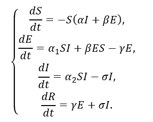
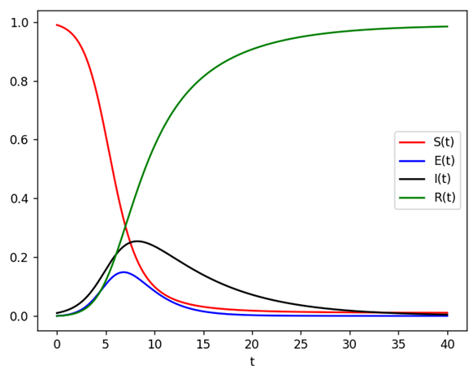
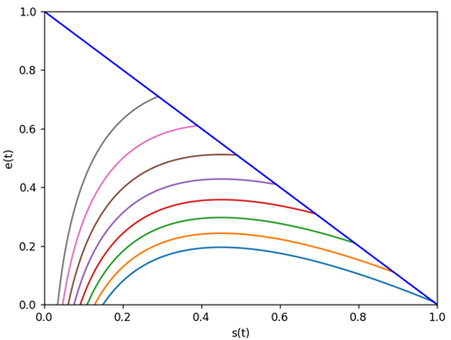
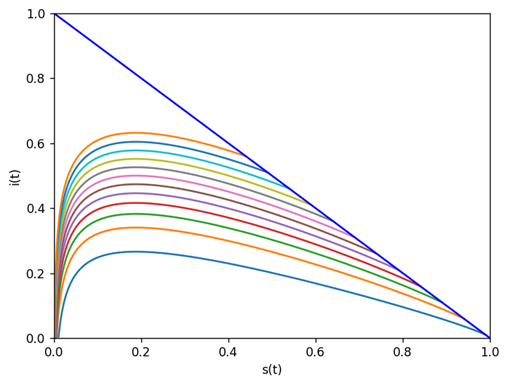
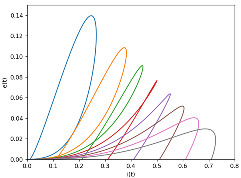

A model of the spread of an epidemic with a latent form of infection or SEIR model is given.  

&alpha; = &alpha;1 + &alpha;2

Graphs of the solution of the system at &alpha;1 = 0.2, &alpha;2 = 0.8, &beta; = 1, &gamma; = 0.45, &sigma; = 0.15.

Phase portraits

